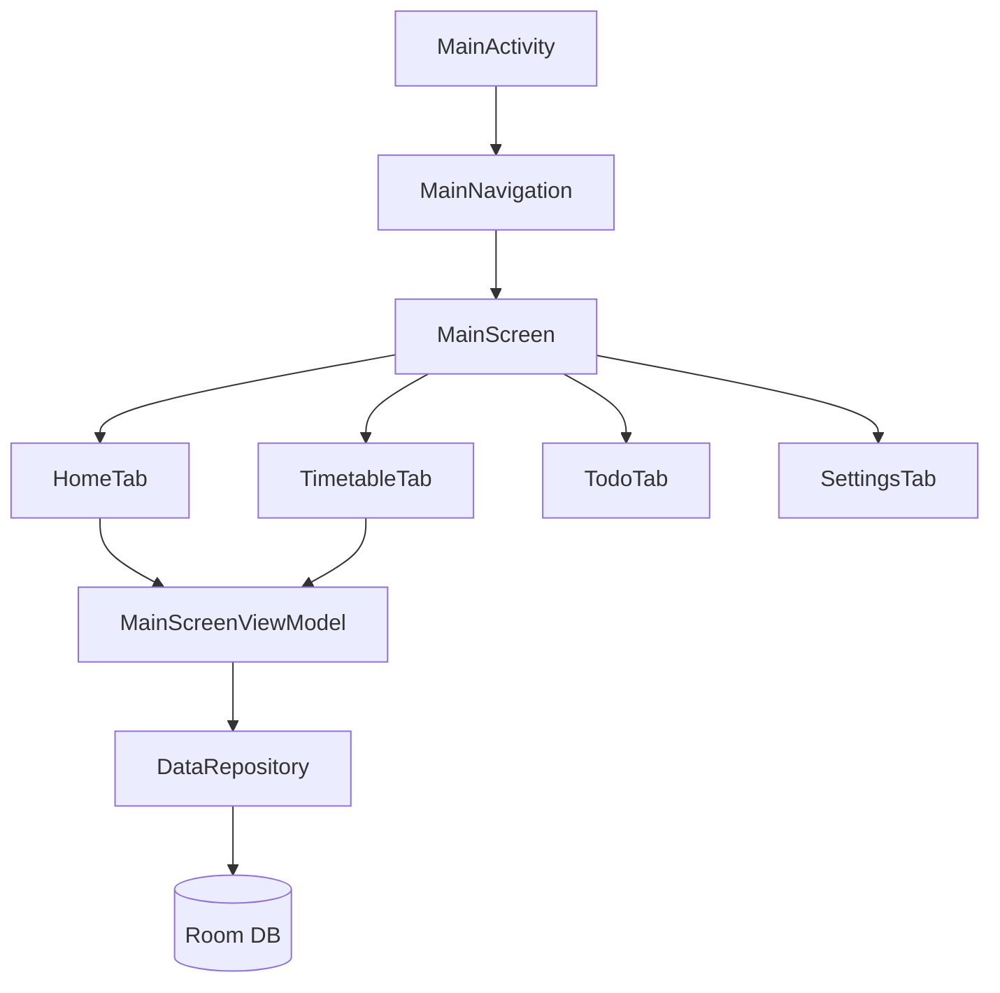

# GlowSchedule

A modern Android class schedule app built with Kotlin & Jetpack Compose.


## Screenshots

<table>
  <tr>
    <td></td>
    <td></td>
    <td></td>
    <td></td>
  </tr>
</table>

_Screenshots will be added when available. Run the app to see the full experience._

## Features

- **Schedule Management** (课程表管理) — Add, edit, and delete courses with an intuitive UI
- **Excel Import** (Excel 导入) — Import course schedules from Excel/CSV files
- **WebView Import** (WebView 教务系统导入) — Import courses from educational portals via WebView
- **Home Screen Widget** (桌面小组件) — Home screen widget showing today's schedule
- **Class Reminders** (课前提醒) — Alarm notifications before class starts
- **Dark Mode / Material You** (暗色模式 / Material You) — Dynamic theming with dark mode support
- **Backup & Restore** (数据备份恢复) — Export and import your data
- **GlowCode Management** (GlowCode 管理) — Parse and manage course codes

## Tech Stack

| Technology       | Version       |
| ---------------- | ------------- |
| Kotlin           | 2.3.20        |
| Compose BOM      | 2026.03.01    |
| Material 3       | —             |
| Room             | 2.8.4         |
| Navigation 3     | 1.0.1         |
| Jetpack Glance   | 1.1.0         |
| Coroutines       | 1.10.2        |
| AGP              | 9.0.1         |

## Architecture

- **Pattern:** MVVM + Repository
- **Modules:** Single `:app` module
- **Persistence:** Room database
- **UI:** Jetpack Compose with Material 3
- **Navigation:** Navigation 3



## Getting Started

### Prerequisites

- [Android Studio](https://developer.android.com/studio) (latest stable)
- JDK 17+
- Android SDK with API 36

### Clone

```bash
git clone https://github.com/OrionArch/GlowSchedule.git
cd GlowSchedule
```

### Build

```bash
./gradlew assembleDebug
```

### Run

Open the project in Android Studio and run on a device or emulator running Android 7.0 (API 24) or higher.

## Project Structure

```
app/src/main/java/com/example/schday/
├── MainActivity.kt
├── Navigation.kt
├── NavigationKeys.kt
├── data/
│   ├── AppDatabase.kt
│   ├── DataRepository.kt
│   ├── dao/
│   │   └── AppDaos.kt
│   └── entity/
│       └── Entities.kt
├── parser/
│   ├── BackupRestore.kt
│   ├── ExcelParser.kt
│   ├── GlowCodeManager.kt
│   └── JSBridge.kt
├── scheduler/
│   └── ClassAlarmReceiver.kt
├── theme/
│   ├── Color.kt
│   ├── Theme.kt
│   └── Type.kt
├── ui/
│   ├── main/
│   │   ├── MainScreen.kt
│   │   └── MainScreenViewModel.kt
│   └── screens/
│       ├── edit/
│       │   └── AddEditCourseScreen.kt
│       ├── home/
│       │   └── HomeTab.kt
│       ├── import/
│       │   └── ImportCoursesScreen.kt
│       ├── settings/
│       │   └── SettingsTab.kt
│       ├── timetable/
│       │   └── TimetableTab.kt
│       └── todo/
│           └── TodoTab.kt
├── utils/
│   └── DateUtils.kt
└── widget/
    └── ScheduleWidget.kt
```

## Testing

```bash
# Unit tests
./gradlew test

# Instrumented tests
./gradlew connectedAndroidTest
```

## Contributing

We welcome contributions! Please see [CONTRIBUTING.md](CONTRIBUTING.md) for guidelines.

## License

This project is licensed under the Apache License 2.0 — see the [LICENSE](LICENSE) file for details.

## Acknowledgments

### Built With

[Kotlin](https://kotlinlang.org/) (JetBrains) | [Jetpack Compose](https://developer.android.com/compose) | [Material 3](https://m3.material.io/) | [Room](https://developer.android.com/training/data-storage/room) | [Navigation 3](https://developer.android.com/guide/navigation) | [Jetpack Glance](https://developer.android.com/develop/ui/compose/widgets) | [AndroidX](https://developer.android.com/jetpack/androidx) | [Gradle](https://gradle.org/) | [Kotlin Coroutines](https://kotlinlang.org/docs/coroutines-overview.html) | [ProGuard](https://www.guardsquare.com/proguard)

### AI Assistance

[Claude](https://www.anthropic.com/claude) by [Anthropic](https://www.anthropic.com/)

### Development Tools

[oh-my-claudecode](https://github.com/Yeachan-Heo/oh-my-claudecode)
