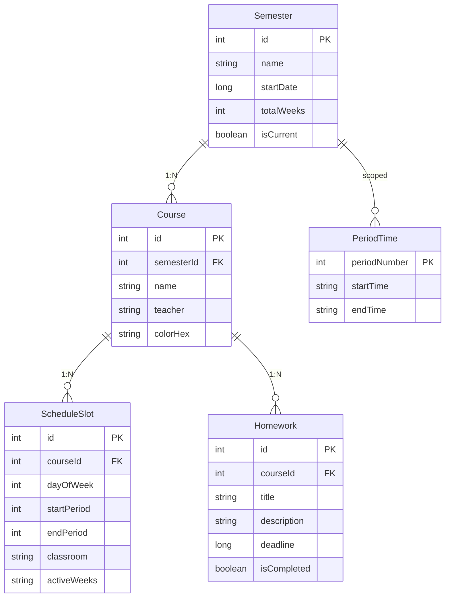
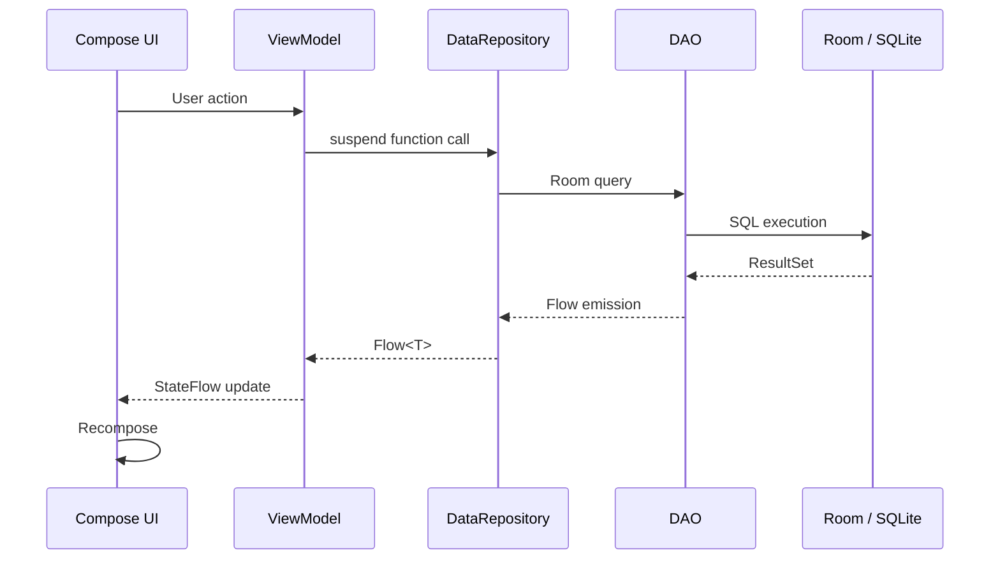
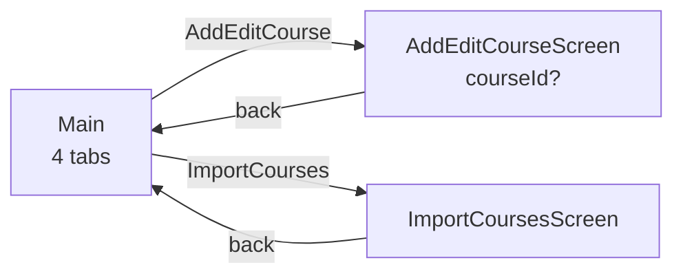

# Architecture

GlowSchedule is a single-module Android app built on **MVVM with manual dependency injection**. There is no DI framework -- the `AppDatabase` singleton is created in `MainActivity` and passed down through composable constructors.

## Data Layer

```mermaid
graph TD
    VM[ViewModel] -->|StateFlow| DR[DataRepository<br/>(interface)]
    DR --> DDR[DefaultDataRepository]
    DDR --> SD[SemesterDao]
    DDR --> CD[CourseDao]
    DDR --> HD[HomeworkDao]
    DDR --> PD[PeriodTimeDao]
    SD --> DB[(AppDatabase<br/>Room v1)]
    CD --> DB
    HD --> DB
    PD --> DB
    DB --> R[(SQLite<br/>schday_database)]
```

- **Source:** `app/src/main/java/com/example/schday/data/DataRepository.kt`
- The `DataRepository` interface defines all data operations. `DefaultDataRepository` delegates to four Room DAOs.
- All query methods return `Flow<T>` for reactive UI updates. Write methods are `suspend` functions.

### Entity Relationships



- **Source:** `app/src/main/java/com/example/schday/data/entity/Entities.kt`
- Five entities: `Semester`, `Course`, `ScheduleSlot`, `Homework`, `PeriodTime`.
- Foreign keys use `CASCADE` deletion -- deleting a semester removes all its courses, which removes their slots and homework.
- `CourseWithSchedules` is a Room `@Relation` POJO that embeds a `Course` with its `List<ScheduleSlot>` and `List<Homework>`.

### DAOs

Defined in `app/src/main/java/com/example/schday/data/dao/AppDaos.kt`:

| DAO | Key Operations |
|-----|---------------|
| `SemesterDao` | CRUD, `getCurrentSemester()`, `setCurrentSemester()` (transaction: clears old, sets new) |
| `CourseDao` | CRUD, `saveCourseWithSlots()` (transaction: insert course, replace slots), `getCoursesBySemester()` returns `Flow<List<CourseWithSchedules>>` |
| `HomeworkDao` | CRUD, `getUncompletedHomework()` filtered by `isCompleted = 0` |
| `PeriodTimeDao` | Batch insert, `getAllPeriodTimes()` |

### Database

- **Source:** `app/src/main/java/com/example/schday/data/AppDatabase.kt`
- Room database, version 1, schema export disabled.
- Singleton via `getDatabase(context)` with double-checked locking.
- Uses `fallbackToDestructiveMigration()` -- schema changes will wipe data.

## Data Flow



All reads go through `Flow`. The UI collects `StateFlow` from ViewModels using `collectAsStateWithLifecycle()`. Writes are triggered by ViewModel methods that call `viewModelScope.launch { repository.xxx() }`.

## Navigation

- **Source:** `app/src/main/java/com/example/schday/Navigation.kt`, `NavigationKeys.kt`
- Uses Navigation 3 (`androidx.navigation3`).



Three navigation keys:

| NavKey | Screen | Parameters |
|--------|--------|------------|
| `Main` | `MainScreen` (tab host) | None |
| `AddEditCourse` | `AddEditCourseScreen` | `courseId: Int?` (null = new course) |
| `ImportCourses` | `ImportCoursesScreen` | None |

`MainScreen` hosts four tabs: **Home**, **Timetable**, **Todo**, **Settings**.

## Key Subsystems

### AlarmScheduler

- **Source:** `app/src/main/java/com/example/schday/scheduler/ClassAlarmReceiver.kt`
- Schedules `AlarmManager` broadcasts for each active class slot on the current day.
- Four alarm actions:

| Action | Trigger | Behavior |
|--------|---------|----------|
| `ACTION_CLASS_REMINDER` | Configurable minutes before class start (default 10) | Posts a high-priority notification with course name and classroom |
| `ACTION_CLASS_START` | Exact class start time | Activates auto-mute (DND, vibrate, or silent based on user preference) |
| `ACTION_CLASS_END` | Exact class end time | Restores previous ringer mode / DND filter |
| `ACTION_HOMEWORK_REMINDER` | Daily at 20:00, reschedules itself | Checks for homework due within 48 hours, posts summary notification |

- `BootReceiver` reschedules all alarms after device reboot.
- Uses `setExactAndAllowWhileIdle` on Android 12+ when `canScheduleExactAlarms()` is true.

### GlowCodeManager

- **Source:** `app/src/main/java/com/example/schday/parser/GlowCodeManager.kt`
- A sharing protocol that encodes course schedules as `glow://` URIs.
- **Encode:** Serializes `List<CourseWithSchedules>` to JSON, Base64-encodes it, prefixes with `glow://`.
- **Decode:** Strips `glow://` prefix, Base64-decodes, parses JSON into `GlowCodeData(title, courses)`.
- Used for sharing courses between devices without a server.

### BackupRestore

- **Source:** `app/src/main/java/com/example/schday/parser/BackupRestore.kt`
- Full JSON export/import of all app data.
- **Export:** Reads all semesters, courses (with slots and homework), and period times into a versioned JSON structure (`"version": 1`).
- **Import:** Parses JSON, re-maps semester IDs for imported data, inserts via repository. Course names are matched to avoid duplicates.

### ScheduleWidget

- **Source:** `app/src/main/java/com/example/schday/widget/ScheduleWidget.kt`
- A compact 2×1 Jetpack Glance home screen widget.
- Shows the current/next class with time, classroom, and progress indicator when a class is in session.
- `ScheduleWidgetReceiver.updateWidget(context)` triggers manual refresh; `DefaultDataRepository` auto-triggers widget updates on all write operations (insert/update/delete for courses, semesters, homework).
- Uses `DateUtils.getCurrentWeek()` and `DateUtils.isWeekActive()` to filter slots by the current week.
- Creates its own `DefaultDataRepository` instance via `AppDatabase.getDatabase(context)`.

## Source File Map

```
app/src/main/java/com/example/schday/
  MainActivity.kt              # Entry point, creates DB and repository
  Navigation.kt                # NavDisplay wiring
  NavigationKeys.kt            # NavKey definitions (Main, AddEditCourse, ImportCourses)
  data/
    AppDatabase.kt             # Room database singleton
    DataRepository.kt          # Interface + DefaultDataRepository
    dao/AppDaos.kt             # SemesterDao, CourseDao, HomeworkDao, PeriodTimeDao
    entity/Entities.kt         # Semester, Course, ScheduleSlot, Homework, PeriodTime, CourseWithSchedules
  parser/
    BackupRestore.kt           # JSON export/import
    ExcelParser.kt             # Excel schedule import
    GlowCodeManager.kt         # glow:// sharing protocol
    JSBridge.kt                # JavaScript bridge for web import
  scheduler/
    ClassAlarmReceiver.kt      # AlarmScheduler, ClassAlarmReceiver, BootReceiver
  theme/
    Color.kt                   # Morandi color palette
    Theme.kt                   # Material 3 theme
    Type.kt                    # Typography
  ui/
    main/
      MainScreen.kt            # Tab host (Home, Timetable, Todo, Settings)
      MainScreenViewModel.kt   # ViewModel for MainScreen
    screens/
      edit/AddEditCourseScreen.kt
      home/HomeTab.kt
      import/ImportCoursesScreen.kt
      settings/SettingsTab.kt
      timetable/TimetableTab.kt
      todo/TodoTab.kt
  utils/
    DateUtils.kt               # Week calculation, date helpers
  widget/
    ScheduleWidget.kt          # Glance home screen widget
```
